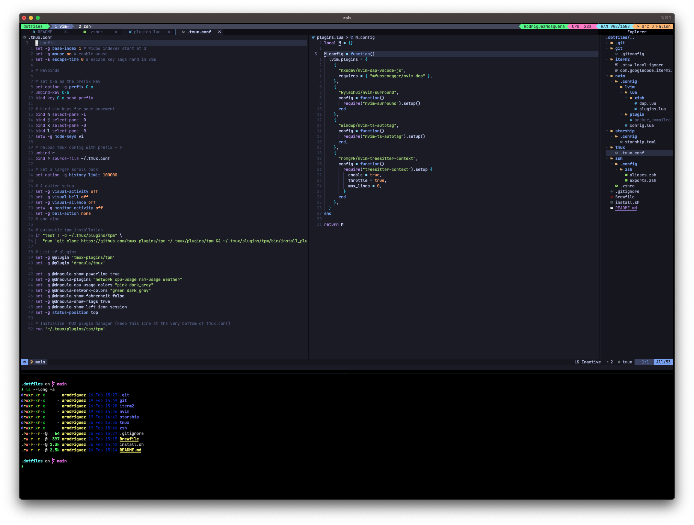

# Dotfiles



All the things I use. This targets OSX only

## Requirements

1. Install Apple's Command Line Tools (they are prereqs for Git and Homebrew)

   ```sh
   xcode-select --install
   ```

2. Update XCode to the latest version. Some apps, like [lazygit](https://github.com/jesseduffield/lazygit), will fail to install otherwise

## Bootstrap a new Mac

1. Clone into a new hidden directory at the root. Make sure that you are using your fork (if forked)

   ```sh
   git clone git@github.com:AndresRodH/dotfiles.git ~/.dotfiles
   ```

2. Run the install script

   ```sh
   cd ~/.dotfiles
   source install.sh
   ```

## What's in it?

There's a lot of stuff in here. Actually, there's a lot of stuff that you may not need! [Fork this repo](https://github.com/AndresRodH/dotfiles/fork), remove what you don't use and add what you do use.

1. [zsh](https://www.zsh.org/)
   - Uses [zap](https://github.com/zap-zsh/zap) as a plugin manager
   - Aliases are set up in [aliases.zsh](`zsh/.config/zsh/aliases.zsh`) and exports in [exports.zsh](`zsh/.config/zsh/exports.zsh`)

2. [tmux](https://github.com/tmux/tmux)
   - Sets up [Tmux Plugin Manager (tpm)](https://github.com/tmux-plugins/tpm) automatically on first run
   - Remaps the prefix to `<C-a>`
   - `<C-a>I` install tmux plugins
   - `<C-a>r` reload tmux configuration
   - Check the [configuration](`tmux/.tmux.conf`) for a list of plugins used

3. [neovim](https://neovim.io/)
   - Uses [lazyvim](https://www.lazyvim.org/) 

4. [Homebrew](https://brew.sh/) - for more info check the [`Brewfile`](Brewfile)

5. [Git profile management](`git/.gitconfig`)

6. [Starship](https://starship.rs/) prompt

## Adding new configurations

Symlinking is done via [GNU Stow](https://www.gnu.org/software/stow/). Stow is included in the Homebrew installation step.

1. Make a new folder, or "package" in GNU stow terms

2. Add the files you want to create symlinks for inside the newly added package. The contents of the folder will be linked to the user's home directory
   - To ignore files within a package, add a [`.stow-local-ignore`](https://www.gnu.org/software/stow/manual/html_node/Types-And-Syntax-Of-Ignore-Lists.html) file. For example, check [`iterm2/.stow-local-ignore`](iterm2/.stow-local-ignore)

3. Run `stow */` to link all packages, or `stow [package name]` to link a specific package. For example, `stow nvim`
